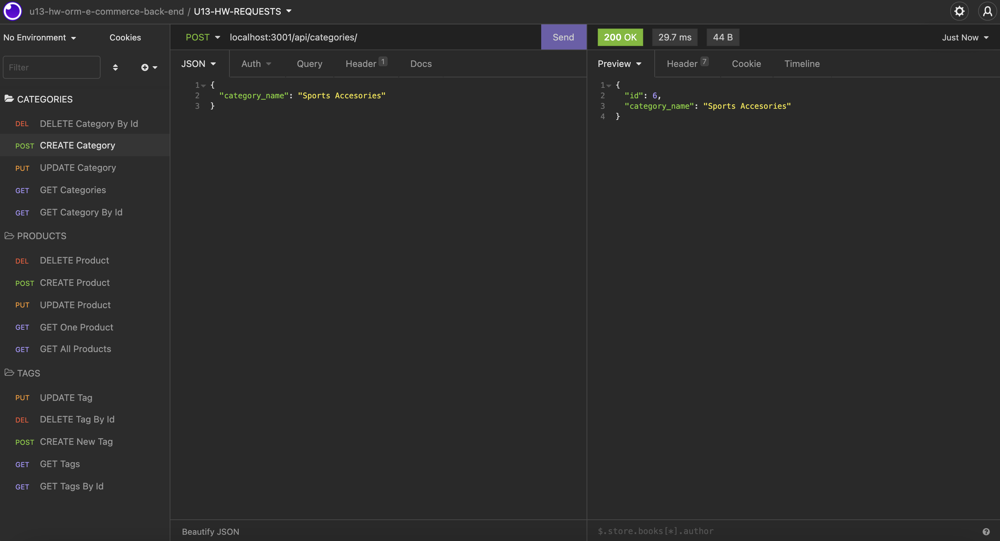

# u13-hw-orm-e-commerce-back-end
ITESM Coding Bootcamp - Unit 13 Homework - Object-Relational Mapping (ORM): E-Commerce Back End

## Description

This was an on-the-job ticket activity where I was given several files with some code already written (schema.db, connection.js, models/index.js, Category.js, Product.js, Tag.js, ProductTag.js, category-seeds.js, product-seeds.js, tag-seeds.js, product-tag-seeds.js, seeds/index.js, routes/index.js, api/index.js, category-routes.js, product-routes.js, tag-routes.js, server.js). My task was to complement some files with additional code to build the Back-End of an e-commerce application, so that Categories, Products and Tags could be read, created, updated and deleted.

First, I set up MySQL user and passwords with environment variables, to get access to MySQL using MySQL2 package. Then, I wrote the code in Category.js, Product.js, Tag.js and ProductTag.js files, to define the columns for the Category, Product, Tag and ProductTag classes, to be able to use these models and instantiate them to create different Categories, Products and Tags, populating the e-commerce_db set up in the schema.sql file using the information inside the seeds directory files. For these models I included some constraints to set Data Types, Primary Keys, Foreign Keys, autoincrements, default values, allow null values or cascade in case of deletion of a parent record in the database. After that, I wrote the code inside models/index.js to set the associations between models, using `belongsTo`, `hasMany` and `belongsToMany`, so that a Category could have many Products, with a Product belonging only to one Category, and Products belonging to many Tags (and viceversa) through the ProductTag Join Table.

The following step was to write the code to define the routes inside the category-routes.js product-routes.js and tag-routes.js files. For this task I used many asynchronous functions using `async` `await`. For the GET routes I used `findAll()` and `findByPk()` Sequelize methods with the respective models, to be able to read the information in the database for existing Categories, Products and Tags. For the POST route I employed the `create()` method, while for the PUT and DELETE routes I used `update()` and `destroy()` methods respectively. The final I wrote was some lines of code in the server.js file using the `sync()` method to synchronize the sequelize models to the database and after that turn on the server.

## Usage & [Walkthrough Video](https://drive.google.com/file/d/1siY7YSGeUNKQLe24yY5z2R1RMjnu1L1-/view?usp=sharing)

To see the application in use watch this [Walkthrough Video](https://drive.google.com/file/d/1siY7YSGeUNKQLe24yY5z2R1RMjnu1L1-/view?usp=sharing)

Here are some images of some routes when they are executed using Insomnia:

 

## Technologies Used

* JavaScript
* Object Oriented Programming
* Object Relational Mapping
* Node.js
* MySQL
* NPM
* Express package
* MySQL2 package
* Sequelize package
* dotenv package
* Insomnia

## Contact Information

* GitHub Profile: [josevidmal](https://github.com/josevidmal)
* email: josevidmal@gmail.com

## License

[The MIT License](https://www.mit.edu/~amini/LICENSE.md)

Copyright 2022 Jose Vidal

Permission is hereby granted, free of charge, to any person obtaining a copy of this software and associated documentation files (the "Software"), to deal in the Software without restriction, including without limitation the rights to use, copy, modify, merge, publish, distribute, sublicense, and/or sell copies of the Software, and to permit persons to whom the Software is furnished to do so, subject to the following conditions:
    
The above copyright notice and this permission notice shall be included in all copies or substantial portions of the Software.
    
THE SOFTWARE IS PROVIDED "AS IS", WITHOUT WARRANTY OF ANY KIND, EXPRESS OR IMPLIED, INCLUDING BUT NOT LIMITED TO THE WARRANTIES OF MERCHANTABILITY, FITNESS FOR A PARTICULAR PURPOSE AND NONINFRINGEMENT. IN NO EVENT SHALL THE AUTHORS OR COPYRIGHT HOLDERS BE LIABLE FOR ANY CLAIM, DAMAGES OR OTHER LIABILITY, WHETHER IN AN ACTION OF CONTRACT, TORT OR OTHERWISE, ARISING FROM, OUT OF OR IN CONNECTION WITH THE SOFTWARE OR THE USE OR OTHER DEALINGS IN THE SOFTWARE.